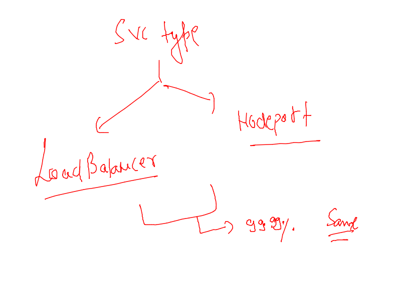
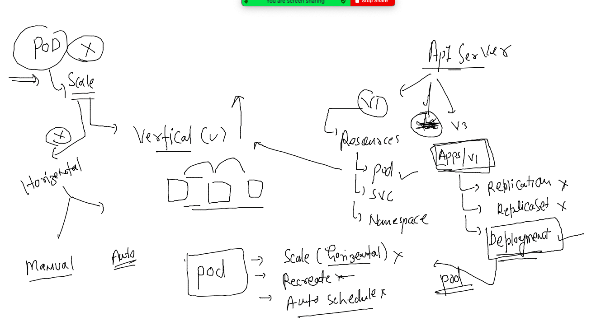
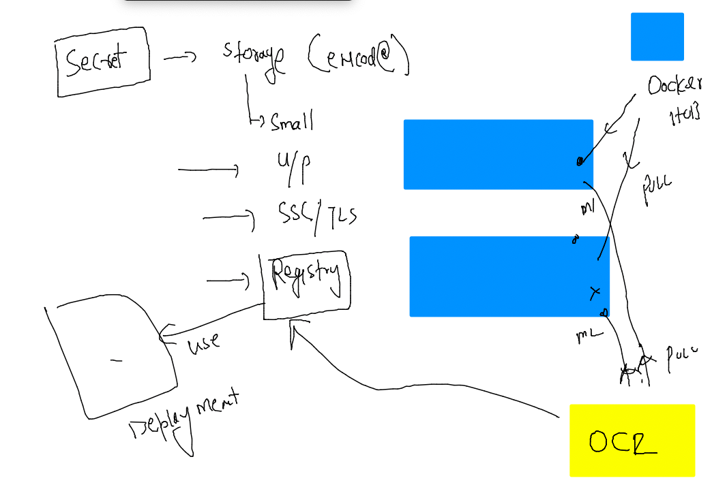
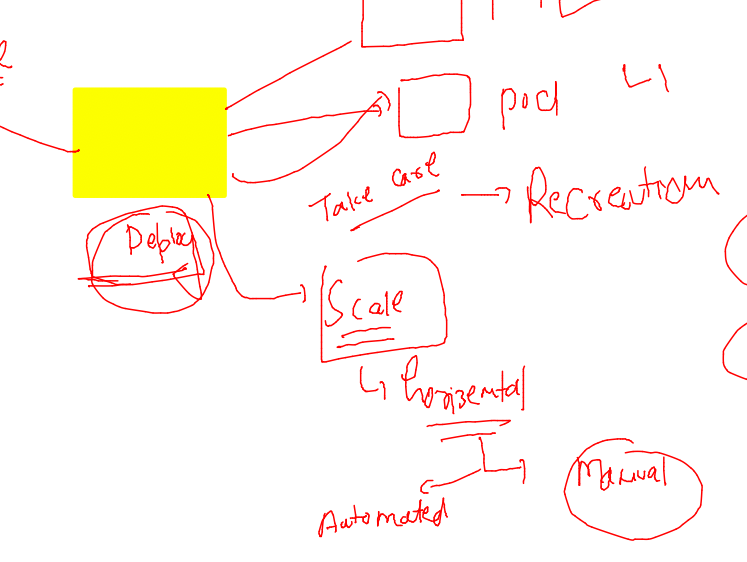
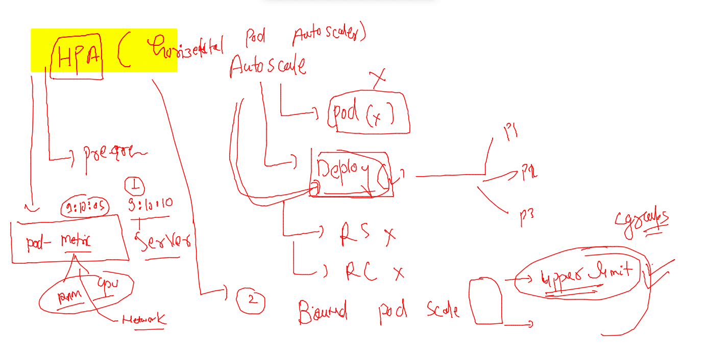
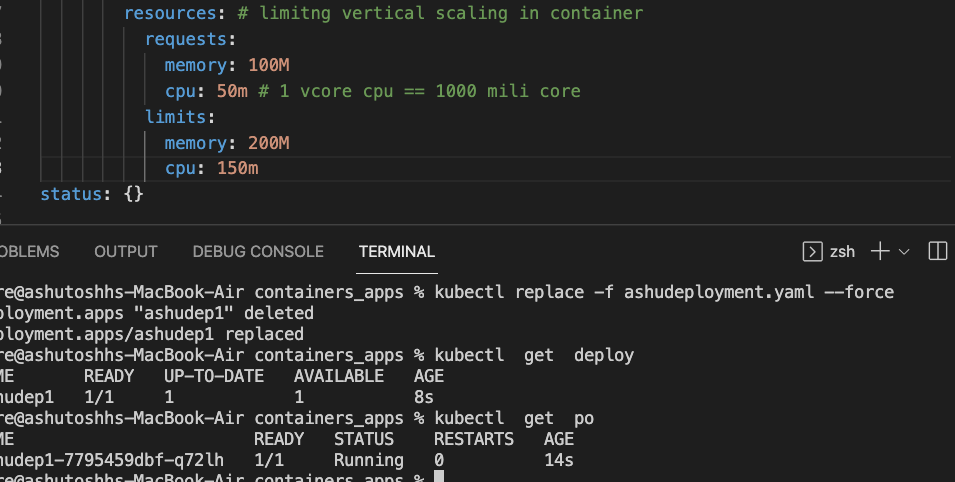

# Plan 


## CNI model of container networking adopted by k8s 


### pods can have ip address from CNI bridge 


### checking pod to pod communication 

```
 kubectl  run  ashupod1  --image=alpine  --command ping 127.0.0.1 
pod/ashupod1 created
fire@ashutoshhs-MacBook-Air ~ % kubectl  get  pods
NAME       READY   STATUS    RESTARTS   AGE
ashupod1   1/1     Running   0          4s
fire@ashutoshhs-MacBook-Air ~ % kubectl  get  pods -o wide
NAME       READY   STATUS    RESTARTS   AGE   IP                NODE      NOMINATED NODE   READINESS GATES
ashupod1   1/1     Running   0          10s   192.168.179.222   minion2   <none>           <none>
fire@ashutoshhs-MacBook-Air ~ % 

```

### testing 

```
 % kubectl  get  pods -o wide
NAME         READY   STATUS              RESTARTS   AGE    IP                NODE      NOMINATED NODE   READINESS GATES
ashupod1     1/1     Running             0          109s   192.168.179.222   minion2   <none>           <none>
natrajpod1   0/1     ContainerCreating   0          2s     <none>            minion2   <none>           <none>
rameshpod1   1/1     Running             0          13s    192.168.34.20     minion1   <none>           <none>
rohitpod1    1/1     Running             0          60s    192.168.179.223   minion2   <none>           <none>
ronipod1     1/1     Running             0          56s    192.168.34.19     minion1   <none>           <none>
fire@ashutoshhs-MacBook-Air ~ % 
fire@ashutoshhs-MacBook-Air ~ % kubectl  exec -it  ashupod1  -- sh 
/ # ping  192.168.34.19
PING 192.168.34.19 (192.168.34.19): 56 data bytes
64 bytes from 192.168.34.19: seq=0 ttl=62 time=0.777 ms
64 bytes from 192.168.34.19: seq=1 ttl=62 time=0.417 ms
64 bytes from 192.168.34.19: seq=2 ttl=62 time=0.369 ms
^C

```

### auto generating pod yaml 

```
 kubectl run ashuweb  --image=dockerashu/customerapp:30thmarch2022   --port 80 --dry-run=client -oyaml  >webapp.yaml

```

### creating webapp pod 

```
kubectl create -f webapp.yaml 
pod/ashuweb created
fire@ashutoshhs-MacBook-Air containers_apps % kubectl  get  pods
NAME      READY   STATUS    RESTARTS   AGE
ashuweb   1/1     Running   0          9s
```

### exposing local to k8s client machine 

```
kubectl port-forward   ashuweb  1234:80 
Forwarding from 127.0.0.1:1234 -> 80
Forwarding from [::1]:1234 -> 80
Handling connection for 1234
Handling connection for 1234

```

### Internal LB 


### Internal LB via Service resource type 


### Service Internal LB will be using Label to find related POds 


### checking and changing label of pods


### label changing methods 

```
1019  kubectl apply  -f webapp.yaml
 1020  kubectl  get pods --show-labels
 1021  history
 1022  kubectl label 
 1023  kubectl label pod ashuweb  x2=helloashuapp
 1024  kubectl  get pods --show-labels
fire@ashutoshhs-MacBook-Air containers_apps % kubectl  replace -f webapp.yaml --force
pod "ashuweb" deleted
pod/ashuweb replaced

```

### checking label of pod

```
% kubectl  get pods --show-labels
NAME           READY   STATUS        RESTARTS   AGE     LABELS
akshweb        1/1     Running       0          68m     run=ashuweb
ashuweb        1/1     Running       0          2m44s   x1=ashutoshhapp

```

### type of service 
### Note: every type of service will be creating Internal LB 


## NodePort

```

fire@ashutoshhs-MacBook-Air containers_apps % kubectl create  service 
Create a service using a specified subcommand.

Aliases:
service, svc

Available Commands:
  clusterip    Create a ClusterIP service
  externalname Create an ExternalName service
  loadbalancer Create a LoadBalancer service
  nodeport     Create a NodePort service


```

### Understanding service creating 


### selector to pod label 


### service deploy 

```
 kubectl create  -f  ashulb1.yaml
 fire@ashutoshhs-MacBook-Air containers_apps % kubectl  get svc
NAME           TYPE        CLUSTER-IP      EXTERNAL-IP   PORT(S)          AGE
ashulb1        NodePort    10.99.145.39    <none>        1234:30257/TCP   10m
devlbaas       NodePort    10.97.67.51     <none>        1234:31583/TCP   9m4s
kubernetes     ClusterIP   10.96.0.1       <none>        443/TCP          163m

```

### External LB and DNs 


### Nodeport Vs loadbalancer service 



### creating LB type service 

```
kubectl  create  service  loadbalancer  ashusvc2 --tcp 1234:80  --dry-run=client -oyaml >ashulb2.yaml 
 1060  history
 1061  kubectl get  po --show-labels
 1062  kubectl create -f ashulb2.yaml 

```

### checking service 

```

fire@ashutoshhs-MacBook-Air containers_apps % kubectl  get svc
NAME           TYPE           CLUSTER-IP       EXTERNAL-IP   PORT(S)          AGE
ashulb1        NodePort       10.99.145.39     <none>        1234:30257/TCP   129m
ashusvc2       LoadBalancer   10.111.106.212   <pending>     1234:31267/TCP   50s
```

## namespace concept 


### checking ns

```
ubectl  get ns
NAME                   STATUS   AGE
default                Active   30h
kube-node-lease        Active   30h
kube-public            Active   30h
kube-system            Active   30h
kubernetes-dashboard   Active   30h
```

### kube-system namespace 

```
kubectl   get  po  -n kube-system 
NAME                                       READY   STATUS    RESTARTS      AGE
calico-kube-controllers-56fcbf9d6b-x64tp   1/1     Running   1 (21h ago)   30h
calico-node-cx5bd                          1/1     Running   1 (21h ago)   30h
calico-node-wh647                          1/1     Running   1 (21h ago)   30h
calico-node-zhzl8                          1/1     Running   1 (21h ago)   30h
coredns-64897985d-62wnk                    1/1     Running
```

### creating namespace 

```
pps fire$ kubectl  create  namespace  ashu-project  
namespace/ashu-project created
ashutoshhs-MacBook-Air:containers_apps fire$ kubectl  get ns
NAME                   STATUS   AGE
ashu-project           Active   3s

```

### setting and checking default namespace 

```
 kubectl   get  pods
No resources found in default namespace.
ashutoshhs-MacBook-Air:containers_apps fire$ kubectl   config set-context  --current --namespace=ashu-project 
Context "kubernetes-admin@kubernetes" modified.
ashutoshhs-MacBook-Air:containers_apps fire$ kubectl   config   get-contexts 
CURRENT   NAME                          CLUSTER      AUTHINFO           NAMESPACE
*         kubernetes-admin@kubernetes   kubernetes   kubernetes-admin   ashu-project
ashutoshhs-MacBook-Air:containers_apps fire$ 
ashutoshhs-MacBook-Air:containers_apps fire$ kubectl   get  pods
No resources found in ashu-project namespace.
```

### deploy data in NS 

```
 kubectl   create  -f webapp.yaml   -f  ashulb1.yaml  
pod/ashuweb created
service/ashulb1 created
ashutoshhs-MacBook-Air:containers_apps fire$ kubectl   get  pod,svc
NAME          READY   STATUS    RESTARTS   AGE
pod/ashuweb   1/1     Running   0          5s

NAME              TYPE       CLUSTER-IP     EXTERNAL-IP   PORT(S)          AGE
service/ashulb1   NodePort   10.98.73.148   <none>        1234:30647/TCP   6s
```

### Intro to deployment 



### creating deployment 

```
kubectl  create  deployment ashudep1  --image=nginx --port 80 --dry-run=client -oyaml  >ashudeployment.yaml
```

### into to secret in k8s 



### creating secret in personal namespace 

```
kubectl create secret docker-registry  myimgsec  --docker-server=phx.ocir.io  --docker-username="axmb.com" --docker-password="TG[2Vm"  --dry-run=client -oyaml  >secret.yaml
```

### secret --

```

fire@ashutoshhs-MacBook-Air containers_apps % kubectl  get secret 
NAME                  TYPE                                  DATA   AGE
default-token-lh76q   kubernetes.io/service-account-token   3      85m
myimgsec              kubernetes.io/dockerconfigjson        1      4s
fire@ashutoshhs-MacBook-Air containers_apps % 
```

### redeployment of deploy file 

```
kubectl replace -f ashudeployment.yaml --force
deployment.apps "ashudep1" deleted
deployment.apps/ashudep1 replaced
fire@ashutoshhs-MacBook-Air containers_apps % kubectl  get  deploy
NAME       READY   UP-TO-DATE   AVAILABLE   AGE
ashudep1   1/1     1            1           15s
fire@ashutoshhs-MacBook-Air containers_apps % kubectl  get   po   
NAME                        READY   STATUS    RESTARTS   AGE
ashudep1-66865d5f79-pmqng   1/1     Running   0          22s

```

### using expose to create service 

```
kubectl  get deploy 
NAME       READY   UP-TO-DATE   AVAILABLE   AGE
ashudep1   1/1     1            1           27m
fire@ashutoshhs-MacBook-Air containers_apps % kubectl  expose  deployment  ashudep1  --type NodePort         --port  1234 --target-port 80  --name  ashulb111 
service/ashulb111 exposed
fire@ashutoshhs-MacBook-Air containers_apps % kubectl get svc 
NAME        TYPE       CLUSTER-IP     EXTERNAL-IP   PORT(S)          AGE
ashulb111   NodePort   10.97.71.134   <none>        1234:31444/TCP   6s
```

### scaling pod horizentally using deployment 



### manual scaling 

```
kubectl scale deployment  ashudep1  --replicas=3

 % kubectl  get  pods 
NAME                        READY   STATUS    RESTARTS   AGE
ashudep1-66865d5f79-rb7xj   1/1     Running   0          10m
ashudep1-66865d5f79-rgt82   1/1     Running   0          18s
ashudep1-66865d5f79-v2qng   1/1     Running   0          18s
fire@ashutoshhs-MacBook-Air containers_apps % kubectl  get  deployment                        
NAME       READY   UP-TO-DATE   AVAILABLE   AGE
ashudep1   3/3     3            3           37m
fire@ashutoshhs-MacBook-Air containers_apps % 
```

### HPA in k8s 



### limit resource using cgroup 



### HPA 

```
kubectl  autoscale  deployment ashudep1  --cpu-percent=70         --min=3  --max=20 
horizontalpodautoscaler.autoscaling/ashudep1 autoscaled
fire@ashutoshhs-MacBook-Air containers_apps % kubectl  get deployNAME       READY   UP-TO-DATE   AVAILABLE   AGE
ashudep1   1/1     1            1           7m2s
fire@ashutoshhs-MacBook-Air containers_apps % kubectl  get deploy
NAME       READY   UP-TO-DATE   AVAILABLE   AGE
ashudep1   3/3     3            3           7m20s
fire@ashutoshhs-MacBook-Air containers_apps % kubectl  get  po
NAME                        READY   STATUS    RESTARTS   AGE
ashudep1-7795459dbf-44567   1/1     Running   0          21s
ashudep1-7795459dbf-lktwl   1/1     Running   0          21s
ashudep1-7795459dbf-q72lh   1/1     Running   0          7m26s
```

### hpa 

```
1136  kubectl  autoscale  deployment ashudep1  --cpu-percent=70         --min=3  --max=20 
 1137  kubectl  get deploy
 1138  kubectl  get deploy
 1139  kubectl  get  po
 1140  kubectl get hpa
fire@ashutoshhs-MacBook-Air containers_apps % kubectl  scale deployment ashudep1 --replicas=2
deployment.apps/ashudep1 scaled
fire@ashutoshhs-MacBook-Air containers_apps % kubectl  get deploy
NAME       READY   UP-TO-DATE   AVAILABLE   AGE
ashudep1   3/3     3            3           9m44s
fire@ashutoshhs-MacBook-Air containers_apps % kubectl  get po    
NAME                        READY   STATUS    RESTARTS   AGE
ashudep1-7795459dbf-44567   1/1     Running   0          2m44s
ashudep1-7795459dbf-lxkvd   1/1     Running   0          14s
ashudep1-7795459dbf-q72lh   1/1     Running   0          9m49s
```
