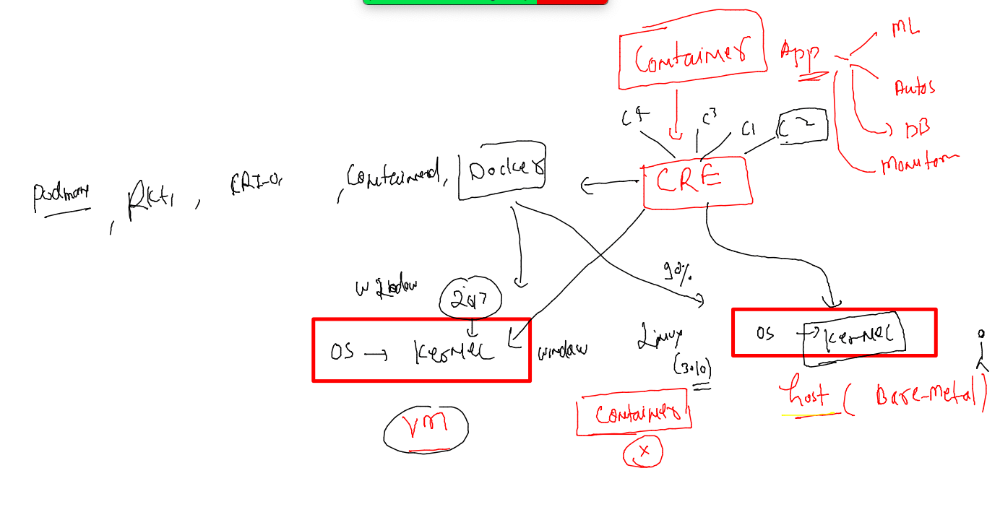
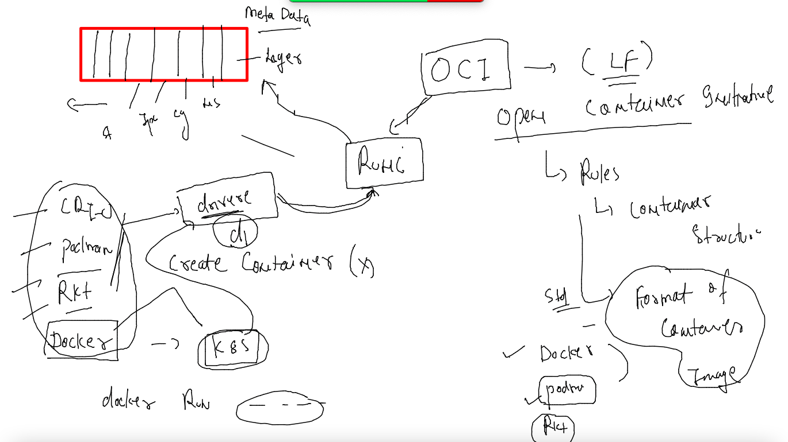
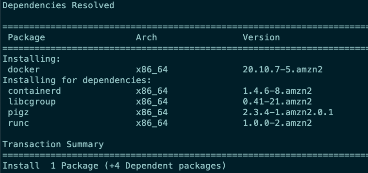
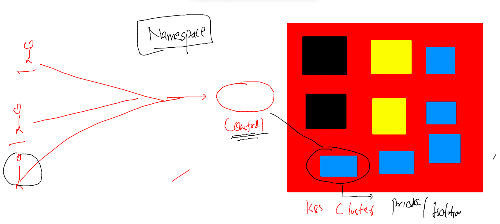
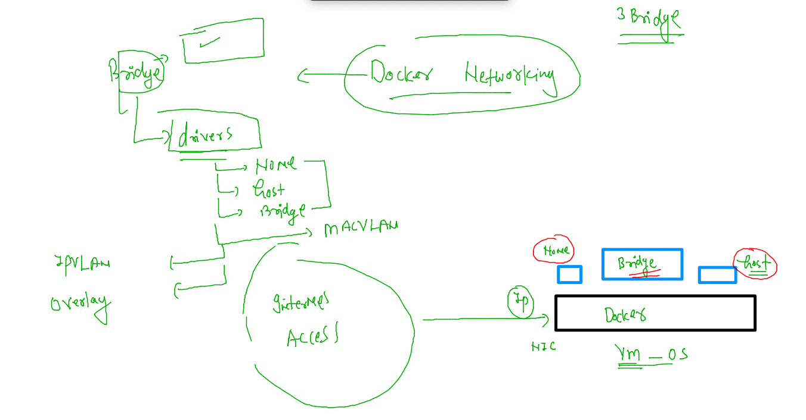
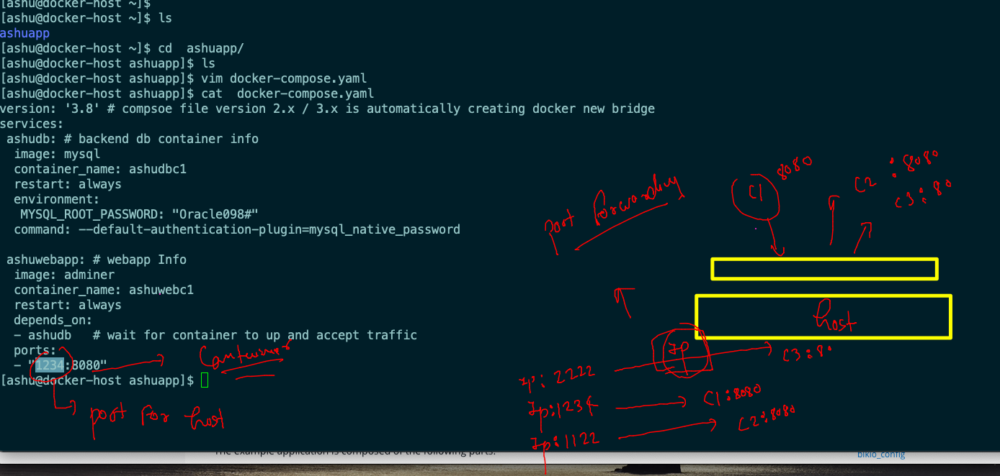

# Plan 


## CRE to Host 



### OCI 



### Docker using RUNC 



### install docker and enable service 

```
 2  yum  install  docker  
    3  history 
    4  systemctl enable --now docker 
    5  systemctl status docker 
```

### NON root users can not access docker serivce 


### addding non root users to docker group 

```
 grep -i docker  /etc/group
docker:x:992:
[root@docker-host ~]# 
[root@docker-host ~]# 
[root@docker-host ~]# for  i in  natraj ashu akshay dev ramesh rohit roni 
> do
> useradd $i 
> echo "Oracle098#" |  passwd $i --stdin 
> done 
Changing password for user natraj.
passwd: all authentication tokens updated successfully.
Changing password for user ashu.
passwd: all authentication tokens updated successfully.
Changing password for user akshay.
passwd: all authentication tokens updated successfully.
Changing password for user dev.
passwd: all authentication tokens updated successfully.
Changing password for user ramesh.
passwd: all authentication tokens updated successfully.
Changing password for user rohit.
passwd: all authentication tokens updated successfully.
Changing password for user roni.
passwd: all authentication tokens updated successfully.
[root@docker-host ~]# su  - ashu 
[ashu@docker-host ~]$ docker  images
Got permission denied while trying to connect to the Docker daemon socket at unix:///var/run/docker.sock: Get "http://%2Fvar%2Frun%2Fdocker.sock/v1.40/images/json": dial unix /var/run/docker.sock: connect: permission denied
[ashu@docker-host ~]$ exit
logout
[root@docker-host ~]# usermod -a -G  docker  ashu
[root@docker-host ~]# grep -i docker  /etc/group
docker:x:992:ashu
[root@docker-host ~]# 
[root@docker-host ~]# su - ashu 
Last login: Mon Apr  4 05:06:28 GMT 2022 on pts/0
[ashu@docker-host ~]$ docker  images
REPOSITORY          TAG                 IMAGE ID            CREATED             SIZE
[ashu@docker-host ~]$ logout
[root@docker-host ~]# for  i in  natraj ashu akshay dev ramesh rohit roni ; do usermod -a -G docker $i ; done 
[root@docker-host ~]# 
[root@docker-host ~]# 
[root@docker-host ~]# grep -i docker  /etc/group
docker:x:992:ashu,natraj,akshay,dev,ramesh,rohit,roni
```

### creating container and checking process 

```
 docker  run -it -d  --name  ashuc1 alpine  
Unable to find image 'alpine:latest' locally
Trying to pull repository docker.io/library/alpine ... 
latest: Pulling from docker.io/library/alpine
40e059520d19: Pull complete 
Digest: sha256:f22945d45ee2eb4dd463ed5a431d9f04fcd80ca768bb1acf898d91ce51f7bf04
Status: Downloaded newer image for alpine:latest
71b7efa07e4d848365d0e4c8140defb4616afdf9eaf93fab38742a0330f47f36
[ashu@docker-host ~]$ 
[ashu@docker-host ~]$ docker  ps
CONTAINER ID        IMAGE               COMMAND             CREATED             STATUS              PORTS               NAMES
71b7efa07e4d        alpine              "/bin/sh"           5 seconds ago       Up 4 seconds                            ashuc1

```

### container using same host kernel but they are isolated due to Namespaces 



### container app process ID 

```
docker  inspect  ddbe5d93bdc1  --format='{{.State.Pid}}'
19718

```

### checking in backend 

```
 cd  /proc/19718/
[root@docker-host 19718]# ls
arch_status  cmdline          environ  io         mem         ns             pagemap      schedstat     stack    task
attr         comm             exe      limits     mountinfo   numa_maps      personality  sessionid     stat     timers
auxv         coredump_filter  fd       loginuid   mounts      oom_adj        projid_map   setgroups     statm    timerslack_ns
cgroup       cpuset           fdinfo   map_files  mountstats  oom_score      root         smaps         status   uid_map
clear_refs   cwd              gid_map  maps       net         oom_score_adj  sched        smaps_rollup  syscall  wchan
[root@docker-host 19718]# ls ns/
cgroup  ipc  mnt  net  pid  pid_for_children  user  uts
```

### Namespace in the backend 

```
nsenter -t  24115  --net  ifconfig 
eth0: flags=4163<UP,BROADCAST,RUNNING,MULTICAST>  mtu 1500
        inet 172.17.0.9  netmask 255.255.0.0  broadcast 172.17.255.255
        ether 02:42:ac:11:00:09  txqueuelen 0  (Ethernet)
        RX packets 98  bytes 9236 (9.0 KiB)
        RX errors 0  dropped 0  overruns 0  frame 0
        TX packets 88  bytes 8168 (7.9 KiB)
        TX errors 0  dropped 0 overruns 0  carrier 0  collisions 0

lo: flags=73<UP,LOOPBACK,RUNNING>  mtu 65536
        inet 127.0.0.1  netmask 255.0.0.0
        loop  txqueuelen 1000  (Local Loopback)
        RX packets 0  bytes 0 (0.0 B)
        RX errors 0  dropped 0  overruns 0  frame 0
        TX packets 0  bytes 0 (0.0 B)
        TX errors 0  dropped 0 overruns 0  carrier 0  collisions 0

[root@docker-host 19718]# nsenter -t  24115  --uts  --mount  sh 
/ # cat etc/os-release 
NAME="Alpine Linux"
ID=alpine
VERSION_ID=3.15.3
PRETTY_NAME="Alpine Linux v3.15"
HOME_URL="https://alpinelinux.org/"
BUG_REPORT_URL="https://bugs.alpinelinux.org/"
/ # ifconfig 
ifconfig: /proc/net/dev: No such file or directory
docker0   Link encap:Ethernet  HWaddr 02:42:E1:36:5B:50  
          inet addr:172.17.0.1  Bcast:172.17.255.255  Mask:255.255.0.0
          UP BROADCAST RUNNING MULTICAST  MTU:1500  Metric:1

ens3      Link encap:Ethernet  HWaddr 02:00:17:09:EC:4F  
          inet addr:10.0.0.76  Bcast:10.0.0.255  Mask:255.255.255.0
          UP BROADCAST RUNNING MULTICAST  MTU:9000  Metric:1

lo        Link encap:Local Loopback  
          inet addr:127.0.0.1  Mask:255.0.0.0
          UP LOOPBACK RUNNING  MTU:65536  Metric:1

/ # exit
[root@docker-host 19718]# ls
ls: cannot open directory .: No such process
[root@docker-host 19718]# nsenter -t  24115  --uts  --mount  sh 
/ # ls
bin    dev    etc    home   lib    media  mnt    opt    proc   root   run    sbin   srv    sys    tmp    usr    var
```

### Docker networking -- 


### remove all containers 

```
docker  rm  $(docker  ps -aq) -f
ddbe5d93bdc1
441bfeed3284
661b529c57a1
55c32ca50e0a

```

### docker network listing 

```
docker  network  ls
NETWORK ID          NAME                DRIVER              SCOPE
a33c26322e2f        bridge              bridge              local
f7b81163f0b8        host                host                local
6b7f3e5566da        none                null                local
[ashu@docker-host ~]$ 
[ashu@docker-host ~]$ docker  network  inspect  a33c26322e2f
[
    {
        "Name": "bridge",
        "Id": "a33c26322e2f5ebfb2fa1eff0d3f2dc40239f08c424e55dabc5082d940334545",
        "Created": "2022-04-04T05:00:52.072497944Z",
        "Scope": "local",
        "Driver": "bridge",
        "EnableIPv6": false,
        "IPAM": {
            "Driver": "default",
            "Options": null,
            "Config": [
                {
                    "Subnet": "172.17.0.0/16"
                }
            ]
        },

```

### checking container connected to the bridge 

```
docker  network inspect a33c26322e2f  
[
    {
        "Name": "bridge",
        "Id": "a33c26322e2f5ebfb2fa1eff0d3f2dc40239f08c424e55dabc5082d940334545",
        "Created": "2022-04-04T05:00:52.072497944Z",
        "Scope": "local",
        "Driver": "bridge",
        "EnableIPv6": false,
        "IPAM": {
            "Driver": "default",
            "Options": null,
            "Config": [
                {
                    "Subnet": "172.17.0.0/16"
                }
            ]
        },
        "Internal": false,
        "Attachable": false,
        "Ingress": false,
        "ConfigFrom": {
            "Network": ""
        },
        "ConfigOnly": false,
        "Containers": {
            "0eb04b89fa28581c44ffd9e179c15306299753b0ebc90c359102726ff112d7a3": {
                "Name": "ronic1",
                "EndpointID": "75ba3066570f322f1dae9bf370a2771fa5099df572fc21a88ac80b6e9ffc4ff1",
                "MacAddress": "02:42:ac:11:00:06",
                "IPv4Address": "172.17.0.6/16",
                "IPv6Address": ""
            },
            "2ad35568e1df917f5b74f8bae354220062baae83f1d5329ad16825a20062398b": {
                "Name": "devv",
                "EndpointID": "b9e7124b7d6c15f13a32cb6136a796177ff9b14408c02633bd076d08e4fc7fc9",
                "MacAddress": "02:42:ac:11:00:03",
                "IPv4Address": "172.17.0.3/16",


```

### playing with Inspect 

```
docker  inspect  ashuc1   --format='{{.Id}}'
9ae4a68b29ebfd9a9fa0a70a038d85b621e3519058999abf29511d9fae20b034
[ashu@docker-host ~]$ docker  inspect  ashuc1   --format='{{.State.Status}}'
running
[ashu@docker-host ~]$ docker  inspect  ashuc1   --format='{{.NetworkSettings.IPAddress}}'
172.17.0.2
[ashu@docker-host ~]$ docker  inspect  ashuc1   --format='{{.NetworkSettings.IPAddress}}'  --format='{{.Id}}'
9ae4a68b29ebfd9a9fa0a70a038d85b621e3519058999abf29511d9fae20b034
[ashu@docker-host ~]$ docker  inspect  ashuc1   --format='{{.NetworkSettings.IPAddress}}  {{.Id}}' 
172.17.0.2  9ae4a68b29ebfd9a9fa0a70a038d85b621e3519058999abf29511d9fae20b034
[ashu@docker-host ~]$ 
[ashu@docker-host ~]$ 
[ashu@docker-host ~]$ 
[ashu@docker-host ~]$ docker  ps -q
64b31538b53e
701a8c63c913
0eb04b89fa28
3a1f2992a1d7
dae68dfbe0ca
2ad35568e1df
9ae4a68b29eb
[ashu@docker-host ~]$ for  i in  `docker  ps -q`
> do
> docker  inspect  $i  --format='{{.NetworkSettings.IPAddress}}  {{.Id}}'
> sleep 1 
> done
172.17.0.8  64b31538b53e7beb9baf23143ffac464117422f7c86229b6a3e8a2ddb4e4c4be
172.17.0.7  701a8c63c9134b28cca153a54df101f05cc5dd780510da68218ccea4ee84fdb3
172.17.0.6  0eb04b89fa28581c44ffd9e179c15306299753b0ebc90c359102726ff112d7a3
172.17.0.5  3a1f2992a1d7fff295f50c4bf0ab25e1b51df834f6b07d4f90b49dbf7b625fed
172.17.0.4  dae68dfbe0ca5859e278d3b7b18c235cd8f5f6ee5607e1cd0589e4d3e59fe8ee
172.17.0.3  2ad35568e1df917f5b74f8bae354220062baae83f1d5329ad16825a20062398b
172.17.0.2  9ae4a68b29ebfd9a9fa0a70a038d85b621e3519058999abf29511d9fae20b034
```

### IN default container bridge only IP based communication is allowed not Name based 

```
docker  inspect  aksh1  --format='{{.NetworkSettings.IPAddress}}'
172.17.0.8
[ashu@docker-host ~]$ docker  exec  -it  ashuc1  sh 
/ # ping  172.17.0.8
PING 172.17.0.8 (172.17.0.8): 56 data bytes
64 bytes from 172.17.0.8: seq=0 ttl=64 time=0.118 ms
64 bytes from 172.17.0.8: seq=1 ttl=64 time=0.092 ms
64 bytes from 172.17.0.8: seq=2 ttl=64 time=0.097 ms
64 bytes from 172.17.0.8: seq=3 ttl=64 time=0.090 ms
^C
--- 172.17.0.8 ping statistics ---
4 packets transmitted, 4 packets received, 0% packet loss
round-trip min/avg/max = 0.090/0.099/0.118 ms
/ # ping  aksh1
ping: bad address 'aksh1'
/ # exit

```

### creating bridge 

```
docker  network  create  ashubr1 
1d1e5ad1e29baf2eae76bde21292e1c9f7416022e60a98e9bc4673f00ed002f1
[ashu@docker-host ~]$ docker  network  create  ashubr2  --subnet  192.168.1.0/24  
e4208088c43e80d4bda5a8b6cf7b9c0d251e3cc4866beda136625a3f5df1a762
[ashu@docker-host ~]$ docker  network  ls
NETWORK ID          NAME                DRIVER              SCOPE
1d1e5ad1e29b        ashubr1             bridge              local
e4208088c43e        ashubr2             bridge              local
a33c26322e2f        bridge              bridge              local
dbda8a7b37b0        devv1               bridge              local
f7b81163f0b8        host                host                local
9afda77bf7d7        natrajbr1           bridge              local
35d0a520be3d        natrajbr2           bridge              local
6b7f3e5566da        none                null                local
ce15d4d341a9        ronic1              bridge              local
b13741763bcd        ronic2              bridge              local
[ashu@docker-host ~]$ docker  network inspect ashubr1 
[
    {
        "Name": "ashubr1",
        "Id": "1d1e5ad1e29baf2eae76bde21292e1c9f7416022e60a98e9bc4673f00ed002f1",
        "Created": "2022-04-04T06:32:39.468315897Z",
        "Scope": "local",
        "Driver": "bridge",
        "EnableIPv6": false,
        "IPAM": {
            "Driver": "default",
            "Options": {},
            "Config": [
                {
                    "Subnet": "172.18.0.0/16",
                    "Gateway": "172.18.0.1"


```

### docker network cross communication is blocked by default 

```
 docker  run -itd --name ashuc3  --network  ashubr1  alpine  
33d0e95cafe848f9fb0c2ca2c7940b4e4eba1d72c5a5b5c2e7582e22edbb405a
[ashu@docker-host ~]$ 
[ashu@docker-host ~]$ docker  exec -it  ashuc3  sh 
/ # ping  172.17.0.2
PING 172.17.0.2 (172.17.0.2): 56 data bytes
^C
--- 172.17.0.2 ping statistics ---
3 packets transmitted, 0 packets received, 100% packet loss

```

### custom bridge DNS is alread there 

```
 docker  run -itd --name ashuc4  --network  ashubr1  alpine  
548dbdcbeffa5a6dae4b4407a15be32f24702356e2274b70b121caa464d5b473
[ashu@docker-host ~]$ 
[ashu@docker-host ~]$ 
[ashu@docker-host ~]$ docker  exec -it  ashuc3  sh 
/ # ping ashuc4
PING ashuc4 (172.18.0.3): 56 data bytes
64 bytes from 172.18.0.3: seq=0 ttl=64 time=0.108 ms
64 bytes from 172.18.0.3: seq=1 ttl=64 time=0.102 ms
64 bytes from 172.18.0.3: seq=2 ttl=64 time=0.112 ms
^C
--- ashuc4 ping statistics ---
3 packets transmitted, 3 packets received, 0% packet loss
round-trip min/avg/max = 0.102/0.107/0.112 ms

```

### COntainer with no network 

```
docker  run -it --rm  --network none  alpine 
/ # 
/ # ifconfig 
lo        Link encap:Local Loopback  
          inet addr:127.0.0.1  Mask:255.0.0.0
          UP LOOPBACK RUNNING  MTU:65536  Metric:1
          RX packets:0 errors:0 dropped:0 overruns:0 frame:0
          TX packets:0 errors:0 dropped:0 overruns:0 carrier:0
          collisions:0 txqueuelen:1000 
          RX bytes:0 (0.0 B)  TX bytes:0 (0.0 B)

/ # ping 172.17.0.1
PING 172.17.0.1 (172.17.0.1): 56 data bytes
ping: sendto: Network unreachable
/ # ping google.com 
^C
/ # exit

```

### restart policy in container 

### create a new container then apply restart policy 

```
~]$ docker run -itd --name x1  --restart  always  alpine 
4a0f4032db2329b2b6dd5b2f65b6a62398a9be1d5293c96423720435f2f5613c
```
## update restart policy in an existing container 

```
ocker  update  aksh2  --restart always 
aksh2
[ashu@docker-host ~]$ docker  ps 
CONTAINER ID        IMAGE               COMMAND             CREATED             STATUS              PORTS               NAMES
6d782fe605de        alpine              "/bin/sh"           18 minutes ago      Up 5 seconds                            aksh2

```

### Port forwarding with docker host 



### compose example 

```
 cat  docker-compose.yaml 
version: '3.8' # compsoe file version 2.x / 3.x is automatically creating docker new bridge 
services:
 ashudb: # backend db container info 
  image: mysql
  container_name: ashudbc1 
  restart: always
  environment:
   MYSQL_ROOT_PASSWORD: "Oracle098#"
  command: --default-authentication-plugin=mysql_native_password

 ashuwebapp: # webapp Info 
  image: adminer
  container_name: ashuwebc1
  restart: always 
  depends_on:
  - ashudb   # wait for container to up and accept traffic 
  ports:
  - "1234:8080"
[ashu@docker-host ashuapp]$ docker-compose up -d
Creating network "ashuapp_default" with the default driver
Creating ashudbc1 ... done
Creating ashuwebc1 ... done
[ashu@docker-host ashuapp]$ docker-compose ps
  Name                 Command               State           Ports         
---------------------------------------------------------------------------
ashudbc1    docker-entrypoint.sh --def ...   Up      3306/tcp, 33060/tcp   
ashuwebc1   entrypoint.sh docker-php-e ...   Up      0.0.0.0:1234->8080/tcp

```

### down 

```
 docker-compose down 
Stopping ashuwebc1 ... done
Stopping ashudbc1  ... done
Removing ashuwebc1 ... done
Removing ashudbc1  ... done
Removing network ashuapp_default

```

### docker image sharing 


### python flask webapp code 

```
ls
Dockerfile  hello.py  requirements.txt
[ashu@docker-host images]$ cat  hello.py 
from flask import Flask 
app = Flask(__name__) 

@app.route('/') 
def hello(): 
	return "welcome to the flask tutorials"


if __name__ == "__main__": 
	app.run(host ='0.0.0.0', port = 5000, debug = True) 
[ashu@docker-host images]$ cat requirements.txt 
flask
[ashu@docker-host images]$ cat  Dockerfile 
FROM python
COPY . /app
WORKDIR /app
RUN pip install -r requirements.txt 
EXPOSE 5000
ENTRYPOINT [ "python" ] 
CMD [ "hello.py" ] 


```

### taking backup of docker image 

```
docker  save  -o webapp.tar  dad5512a6de3
[ashu@docker-host images]$ ls
Dockerfile  hello.py  requirements.txt  webapp.tar
```

### transfer file from  old docker host to new docker host using any FTP method 

```
ls
Dockerfile  hello.py  requirements.txt  webapp.tar
[ashu@docker-host images]$ scp  webapp.tar  test@18.214.154.73:
The authenticity of host '18.214.154.73 (18.214.154.73)' can't be established.
ECDSA key fingerprint is SHA256:2iJHUDm2ruJ+7DqoU754iNNMN2hiTR8Y9AnlK3ESFFI.
ECDSA key fingerprint is MD5:f8:bf:ec:1c:a1:cb:59:1b:41:f9:84:b8:4c:ab:1a:b3.
Are you sure you want to continue connecting (yes/no)? yes
Warning: Permanently added '18.214.154.73' (ECDSA) to the list of known hosts.
test@18.214.154.73's password: 
webapp.tar                                             
```
### oN the new docker host 

```
 ls
webapp.tar
[test@ip-172-31-80-255 ~]$ docker  images
REPOSITORY   TAG       IMAGE ID   CREATED   SIZE
[test@ip-172-31-80-255 ~]$ docker  load -i webapp.tar 
a1c01e366b99: Loading layer [==================================================>]  5.855MB/5.855MB
Loaded image ID: sha256:dad5512a6de319266e17d48ad4d667032fe9419e2ff345e5340956f84603cea4
[test@ip-172-31-80-255 ~]$ docker images
REPOSITORY   TAG       IMAGE ID       CREATED       SIZE
<none>       <none>    dad5512a6de3   4 hours ago   5.57MB
[test@ip-172-31-80-255 ~]$ docker  tag dad5512a6de3  alpine:v1 
[test@ip-172-31-80-255 ~]$ docker images
REPOSITORY   TAG       IMAGE ID       CREATED       SIZE
alpine       v1        dad5512a6de3   5 hours ago   5.57MB
```

