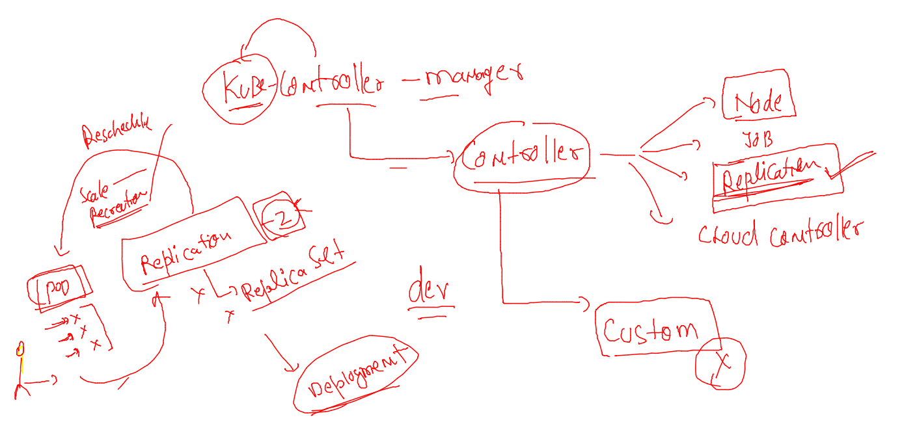
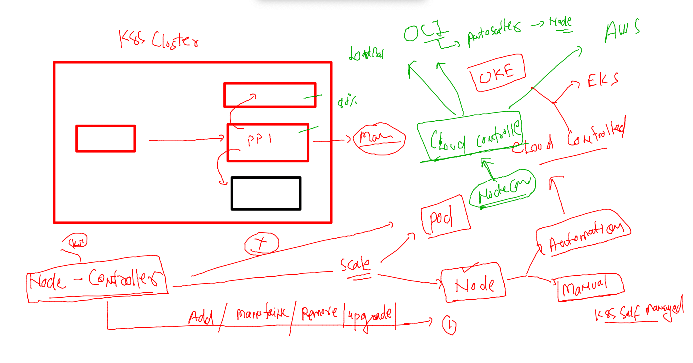
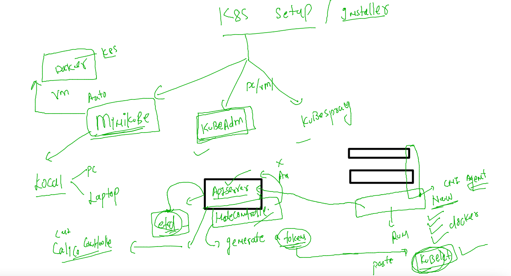

# Plan 


## k8s advanced controllers 

### RC 


### cloud controller and node controller 



### new minion node registration 



### creating token for new minion join -- in control plane

```
kubeadm   token  create  --print-join-command

```

### paste output in new node u want to join as minion 

