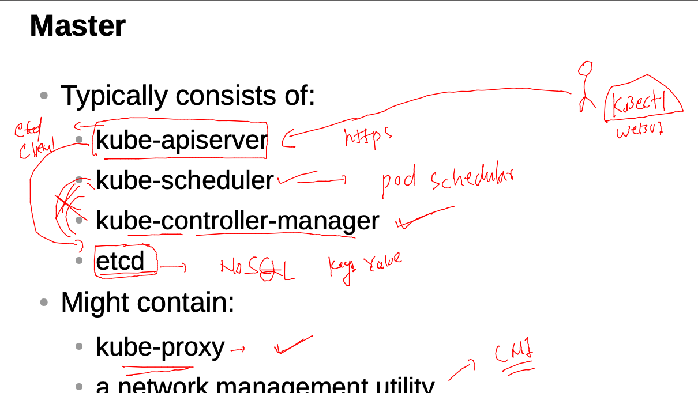
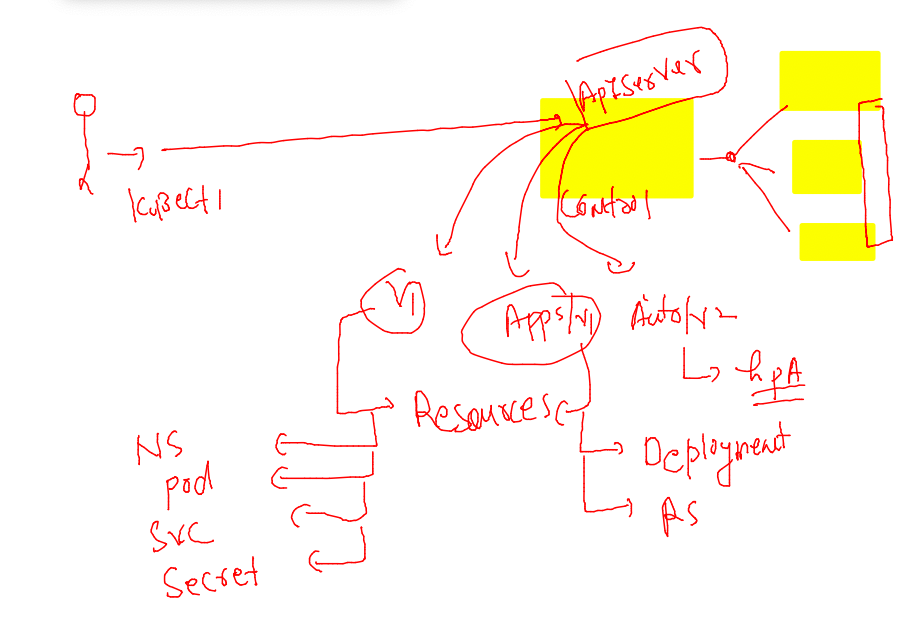
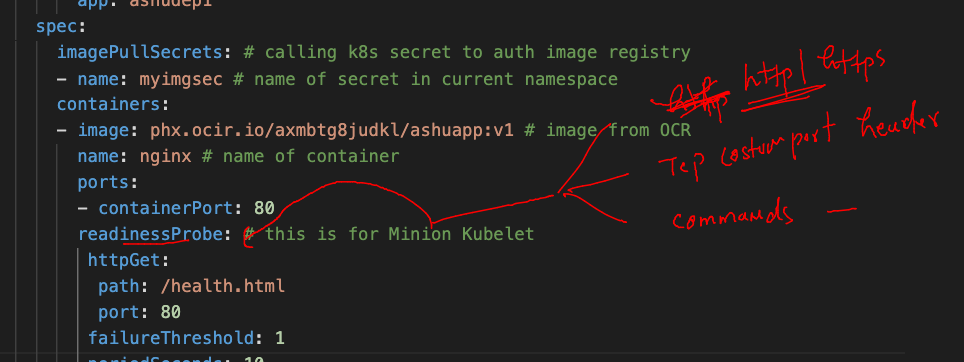

# Plan 


### revision for master node 



### apiversions and their resources 



### last example deploy with OCR image 

```
kubectl create -f ashudeployment.yaml 
deployment.apps/ashudep1 created
fire@ashutoshhs-MacBook-Air containers_apps % kubectl  get deploy 
NAME       READY   UP-TO-DATE   AVAILABLE   AGE
ashudep1   1/1     1            1           8s
fire@ashutoshhs-MacBook-Air containers_apps % kubectl  get secret 
NAME                  TYPE                                  DATA   AGE
default-token-lh76q   kubernetes.io/service-account-token   3      19h
myimgsec              kubernetes.io/dockerconfigjson        1      17h
fire@ashutoshhs-MacBook-Air containers_apps % kubectl  get  pod  
NAME                        READY   STATUS    RESTARTS   AGE
ashudep1-7795459dbf-4qfvq   1/1     Running   0          18s
```

### creating service from deployment 

```
kubectl  get deploy 
NAME       READY   UP-TO-DATE   AVAILABLE   AGE
ashudep1   1/1     1            1           5m54s

----
kubectl  expose deploy ashudep1 --type NodePort --port 1234    --target-port 80  --name  ashulb1 
```

### apply readinesprobe for internal LB to pod health check -- managed by kubelet 



### yaml --

```
apiVersion: apps/v1
kind: Deployment
metadata:
  creationTimestamp: null
  labels:
    app: ashudep1
  name: ashudep1 # name of deployment  
spec:
  replicas: 1 # number of pods we want initially 
  selector:
    matchLabels:
      app: ashudep1
  strategy: {}
  template: # using tempalte deployment will be creating pods 
    metadata:
      creationTimestamp: null
      labels: # label of 
        app: ashudep1
    spec:
      imagePullSecrets: # calling k8s secret to auth image registry 
      - name: myimgsec # name of secret in current namespace 
      containers:
      - image: phx.ocir.io/axmbtg8judkl/ashuapp:v1 # image from OCR  
        name: nginx # name of container 
        ports:
        - containerPort: 80
        readinessProbe: # this is for Minion Kubelet 
         httpGet: 
          path: /health.html
          port: 80 
         failureThreshold: 1 
         periodSeconds: 10 

        livenessProbe: # this is for Minion Kubelet 
         httpGet: 
          path: /health1.html
          port: 80 
         failureThreshold: 2
         periodSeconds: 10
        resources: # limitng vertical scaling in container 
          requests:
            memory: 100M
            cpu: 50m # 1 vcore cpu == 1000 mili core 
          limits:
            memory: 200M
            cpu: 150m 
status: {}

```
### implement HPA in deployment 

```
kubectl  autoscale deployment  ashudep1  --cpu-percent=5  --min=2  --max=10 --dry-run=client -oyaml   >hpa.yaml
fire@ashutoshhs-MacBook-Air containers_apps % kubectl apply -f hpa.yaml 
horizontalpodautoscaler.autoscaling/ashudep1 created
fire@ashutoshhs-MacBook-Air containers_apps % kubectl get  hpa
NAME       REFERENCE             TARGETS   MINPODS   MAXPODS   REPLICAS   AGE
ashudep1   Deployment/ashudep1   2%/5%     2         10        2          47s
```

### random attacker pod 

```
 kubectl  run -it  --rm   attacker  --image=busybox
```

### command to run inside pod 

```
while sleep 0.01 ; do  wget -q -O-  http://ashulb1:1234 ;  done
```


