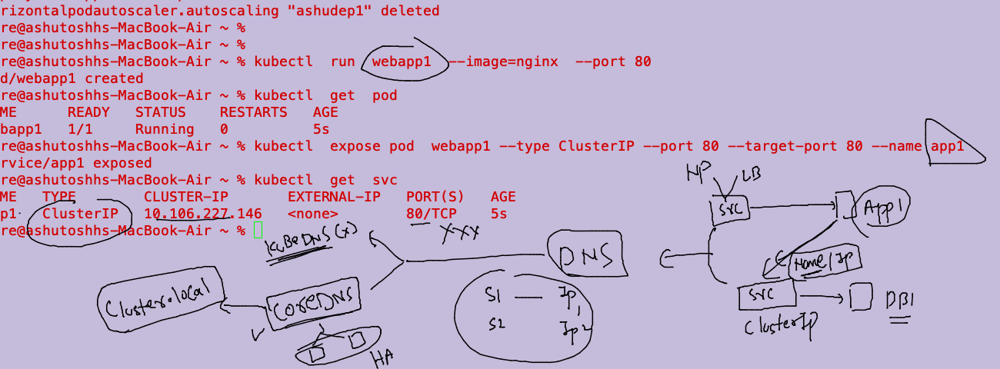
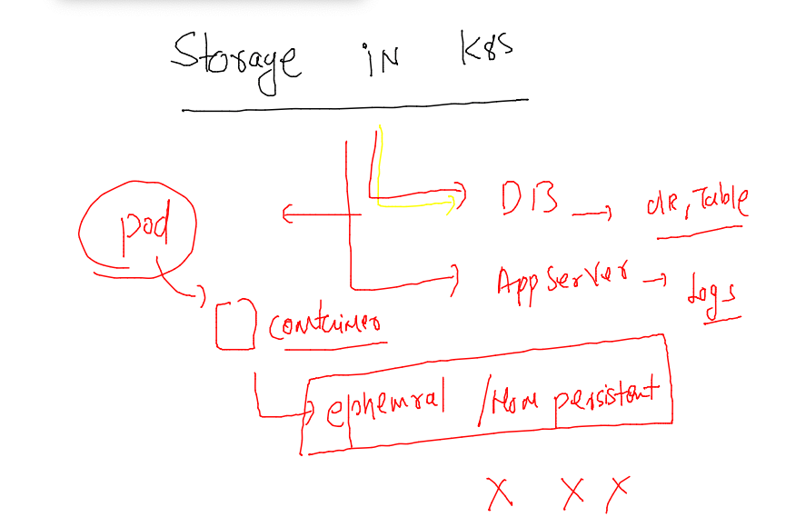
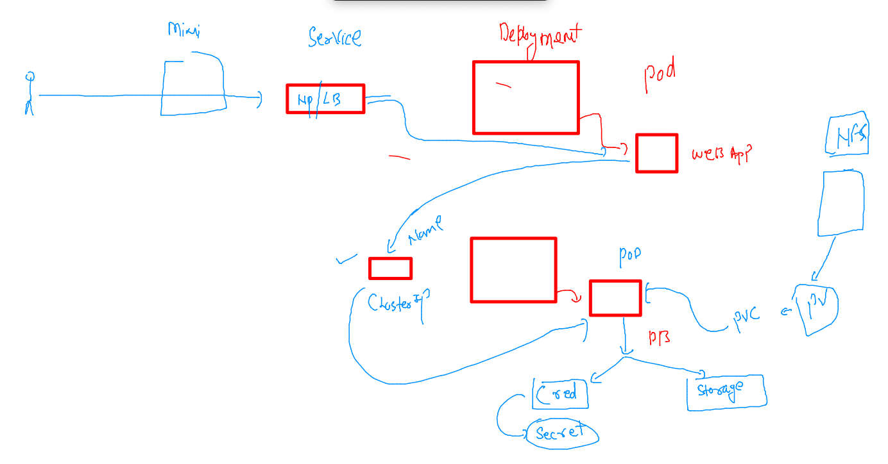
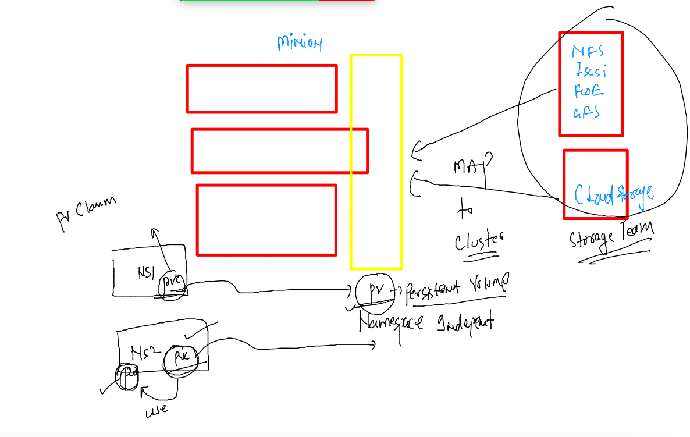

# Plan 


### revision for master node 


### apiversions and their resources 


### last example deploy with OCR image 

```
kubectl create -f ashudeployment.yaml 
deployment.apps/ashudep1 created
fire@ashutoshhs-MacBook-Air containers_apps % kubectl  get deploy 
NAME       READY   UP-TO-DATE   AVAILABLE   AGE
ashudep1   1/1     1            1           8s
fire@ashutoshhs-MacBook-Air containers_apps % kubectl  get secret 
NAME                  TYPE                                  DATA   AGE
default-token-lh76q   kubernetes.io/service-account-token   3      19h
myimgsec              kubernetes.io/dockerconfigjson        1      17h
fire@ashutoshhs-MacBook-Air containers_apps % kubectl  get  pod  
NAME                        READY   STATUS    RESTARTS   AGE
ashudep1-7795459dbf-4qfvq   1/1     Running   0          18s
```

### creating service from deployment 

```
kubectl  get deploy 
NAME       READY   UP-TO-DATE   AVAILABLE   AGE
ashudep1   1/1     1            1           5m54s

----
kubectl  expose deploy ashudep1 --type NodePort --port 1234    --target-port 80  --name  ashulb1 
```

### apply readinesprobe for internal LB to pod health check -- managed by kubelet 


### yaml --

```
apiVersion: apps/v1
kind: Deployment
metadata:
  creationTimestamp: null
  labels:
    app: ashudep1
  name: ashudep1 # name of deployment  
spec:
  replicas: 1 # number of pods we want initially 
  selector:
    matchLabels:
      app: ashudep1
  strategy: {}
  template: # using tempalte deployment will be creating pods 
    metadata:
      creationTimestamp: null
      labels: # label of 
        app: ashudep1
    spec:
      imagePullSecrets: # calling k8s secret to auth image registry 
      - name: myimgsec # name of secret in current namespace 
      containers:
      - image: phx.ocir.io/axmbtg8judkl/ashuapp:v1 # image from OCR  
        name: nginx # name of container 
        ports:
        - containerPort: 80
        readinessProbe: # this is for Minion Kubelet 
         httpGet: 
          path: /health.html
          port: 80 
         failureThreshold: 1 
         periodSeconds: 10 

        livenessProbe: # this is for Minion Kubelet 
         httpGet: 
          path: /health1.html
          port: 80 
         failureThreshold: 2
         periodSeconds: 10
        resources: # limitng vertical scaling in container 
          requests:
            memory: 100M
            cpu: 50m # 1 vcore cpu == 1000 mili core 
          limits:
            memory: 200M
            cpu: 150m 
status: {}

```
### implement HPA in deployment 

```
kubectl  autoscale deployment  ashudep1  --cpu-percent=5  --min=2  --max=10 --dry-run=client -oyaml   >hpa.yaml
fire@ashutoshhs-MacBook-Air containers_apps % kubectl apply -f hpa.yaml 
horizontalpodautoscaler.autoscaling/ashudep1 created
fire@ashutoshhs-MacBook-Air containers_apps % kubectl get  hpa
NAME       REFERENCE             TARGETS   MINPODS   MAXPODS   REPLICAS   AGE
ashudep1   Deployment/ashudep1   2%/5%     2         10        2          47s
```

### random attacker pod 

```
 kubectl  run -it  --rm   attacker  --image=busybox
```

### command to run inside pod 

```
while sleep 0.01 ; do  wget -q -O-  http://ashulb1:1234 ;  done
```

### DNS inside k8s 

### case1 

```
% kubectl  run  webapp1  --image=nginx  --port 80 
pod/webapp1 created
fire@ashutoshhs-MacBook-Air ~ % kubectl  get  pod 
NAME      READY   STATUS    RESTARTS   AGE
webapp1   1/1     Running   0          5s
fire@ashutoshhs-MacBook-Air ~ % kubectl  expose pod  webapp1 --type ClusterIP --port 80 --target-port 80 --name app1
service/app1 exposed
fire@ashutoshhs-MacBook-Air ~ % kubectl  get  svc
NAME   TYPE        CLUSTER-IP       EXTERNAL-IP   PORT(S)   AGE
app1   ClusterIP   10.106.227.146   <none>        80/TCP    5s
fire@ashutoshhs-MacBook-Air ~ % 

```
### COREDNS 



### DNS close info 

```
 kubectl  get po -n kube-system 
NAME                                       READY   STATUS    RESTARTS      AGE
calico-kube-controllers-56fcbf9d6b-x64tp   1/1     Running   2 (18h ago)   2d4h
calico-node-cx5bd                          1/1     Running   2 (18h ago)   2d4h
calico-node-wh647                          1/1     Running   2 (18h ago)   2d4h
calico-node-zhzl8                          1/1     Running   2 (18h ago)   2d4h
coredns-64897985d-62wnk                    1/1     Running   2 (18h ago)   2d4h
coredns-64897985d-brg8m                    1/1     Running   2 (18h ago)   2d4h
etcd-control-plane                         1/1     Running   2 (18h ago)   2d4h
kube-apiserver-control-plane               1/1     Running   2 (18h ago)   2d4h
kube-controller-manager-control-plane      1/1     Running   2 (18h ago)   2d4h
kube-proxy-4t2js                           1/1     Running   2 (18h ago)   2d4h
kube-proxy-xtpjq                           1/1     Running   2 (18h ago)   2d4h
kube-proxy-z5gkz                           1/1     Running   2 (18h ago)   2d4h
kube-scheduler-control-plane               1/1     Running   2 (18h ago)   2d4h
metrics-server-5c69db44f5-x78mc            1/1     Running   2 (18h ago)   2d3h
fire@ashutoshhs-MacBook-Air ~ % kubectl  get svc -n kube-system 
NAME             TYPE        CLUSTER-IP     EXTERNAL-IP   PORT(S)                  AGE
kube-dns         ClusterIP   10.96.0.10     <none>        53/UDP,53/TCP,9153/TCP   2d4h
metrics-server   ClusterIP   10.104.71.65   <none>        443/TCP                  2d3h
fire@ashutoshhs-MacBook-Air ~ % kubectl  run -it --rm testing  --image=busybox 
If you don't see a command prompt, try pressing enter.
/ # 
/ # cat  /etc/resolv.conf 
nameserver 10.96.0.10

```
## Storage in k8s 



### storge in more details 


### check pod data

```
kubectl  get po 
NAME      READY   STATUS    RESTARTS   AGE
datagen   1/1     Running   0          74s
fire@ashutoshhs-MacBook-Air ~ % kubectl  exec -it  datagen -- sh 
/ # 
/ # 
/ # cd  /mnt/
/mnt # ls
time.txt
/mnt # wc -l time.txt 
4 time.txt
/mnt # cat  time.txt 
Thu Apr  7 06:54:14 UTC 2022
Thu Apr  7 06:54:44 UTC 2022
Thu Apr  7 06:55:14 UTC 2022
Thu Apr  7 06:55:44 UTC 2022
/mnt # exit

```

### APp deployment with webpp + db + storage 



## Understanding PV and PVC 



## storage team will configure NFS server

```
[root@ip-172-31-12-7 ~]# for  i  in  ashu  natraj akshay dev ramesh rohit roni 
> do
> mkdir -p  /db/$i 
> echo "/db/$i  *(rw,no_root_squash)" >>/etc/exports
> done 
[root@ip-172-31-12-7 ~]# chmod 777 /db/ -R
[root@ip-172-31-12-7 ~]# 
[root@ip-172-31-12-7 ~]# vim /etc/exports
[root@ip-172-31-12-7 ~]# systemctl restart nfs-server
[root@ip-172-31-12-7 ~]# exportfs  -r
[root@ip-172-31-12-7 ~]# exportfs  -v
/db/ashu      	<world>(rw,sync,wdelay,hide,no_subtree_check,sec=sys,secure,no_root_squash,no_all_squash)
/db/roni      	<world>(rw,sync,wdelay,hide,no_subtree_check,sec=sys,secure,no_root_squash,no_all_squash)
/db/natraj    	<world>(rw,sync,wdelay,hide,no_subtree_check,sec=sys,secure,no_root_squash,no_all_squash)
/db/akshay    	<world>(rw,sync,wdelay,hide,no_subtree_check,sec=sys,secure,no_root_squash,no_all_squash)
/db/dev       	<world>(rw,sync,wdelay,hide,no_subtree_check,sec=sys,secure,no_root_squash,no_all_squash)
/db/ramesh    	<world>(rw,sync,wdelay,hide,no_subtree_check,sec=sys,secure,no_root_squash,no_all_squash)
/db/rohit     	<world>(rw,sync,wdelay,hide,no_subtree_check,sec=sys,secure,no_root_squash,no_all_squash)
```


### creating pv and pvc 

```
 % kubectl apply -f multtier
persistentvolume/ashupv-007 unchanged
persistentvolumeclaim/ashupvc-fordb created
fire@ashutoshhs-MacBook-Air containers_apps % kubectl  get pvc
NAME            STATUS   VOLUME          CAPACITY   ACCESS MODES   STORAGECLASS   AGE
ashupvc-fordb   Bound    natarajan-007   5Gi        RWX            self-managed   69s
```

### creating secret to store DB users password 

```
 kubectl  create  secret  generic  dbpass --from-literal           mypass="Oracle098#" --dry-run=client -oyaml
 
  kubectl apply -f multtier 
secret/dbpass created
persistentvolume/ashupv-007 unchanged
persistentvolumeclaim/ashupvc-fordb unchanged
fire@ashutoshhs-MacBook-Air containers_apps % kubectl  get secret
NAME                  TYPE                                  DATA   AGE
dbpass                Opaque                                1      6s

```

### creating DB deployment --

```
kubectl create deployment  ashudb --image=mysql:5.6  --port 3306  --dry-run=client -oyaml >multtier/dbdep.yaml

```


