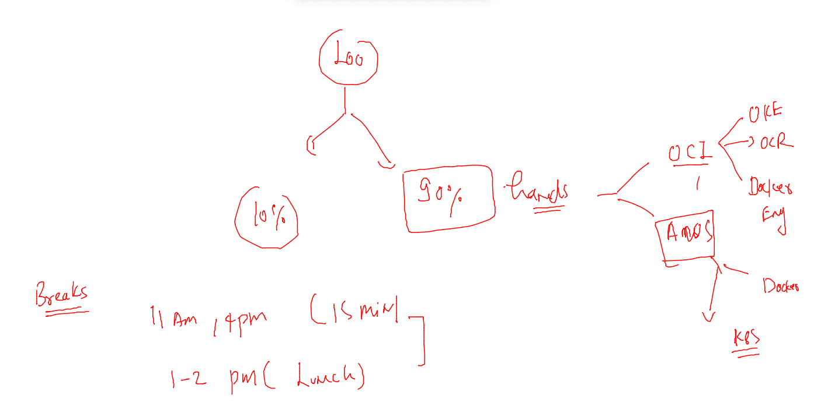
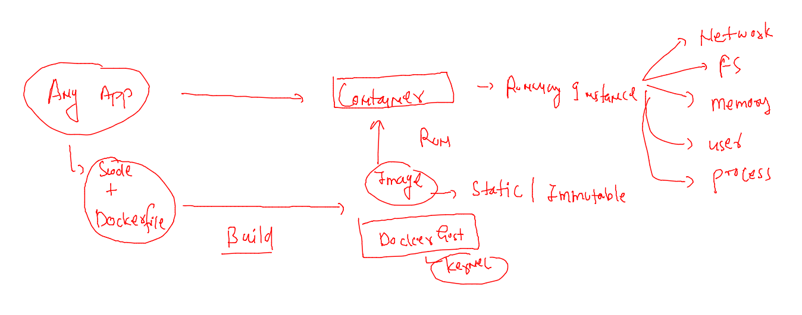
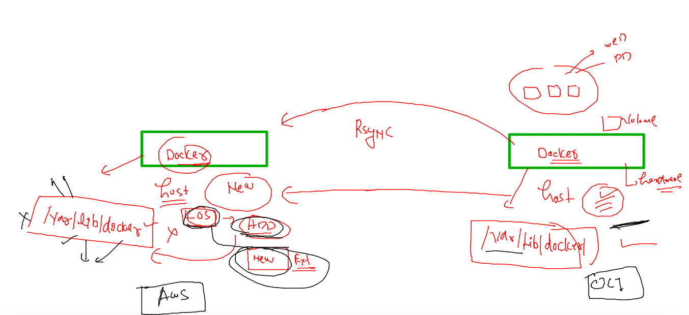
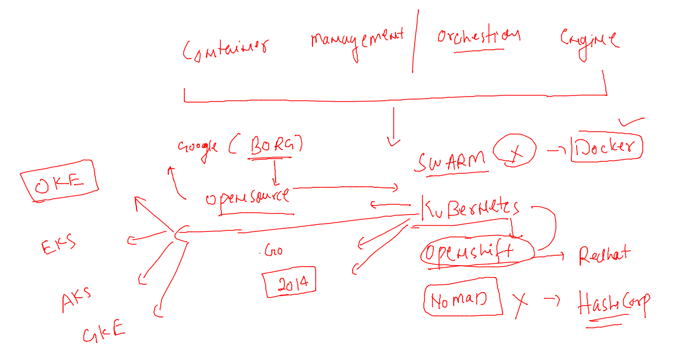
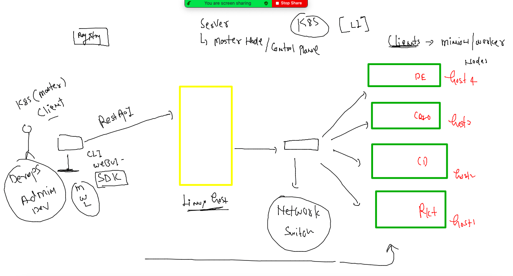
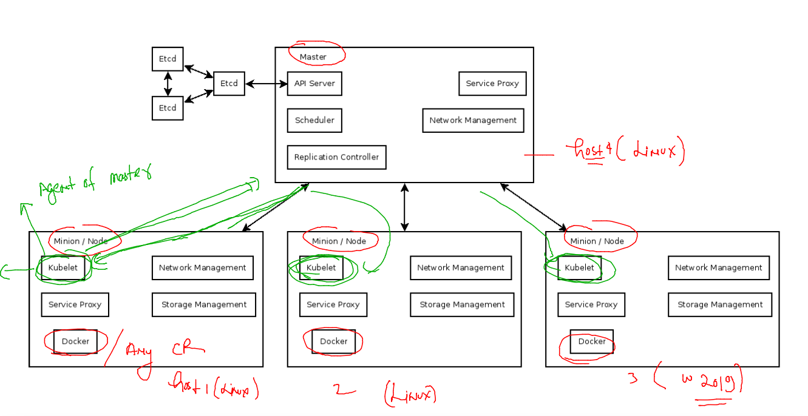
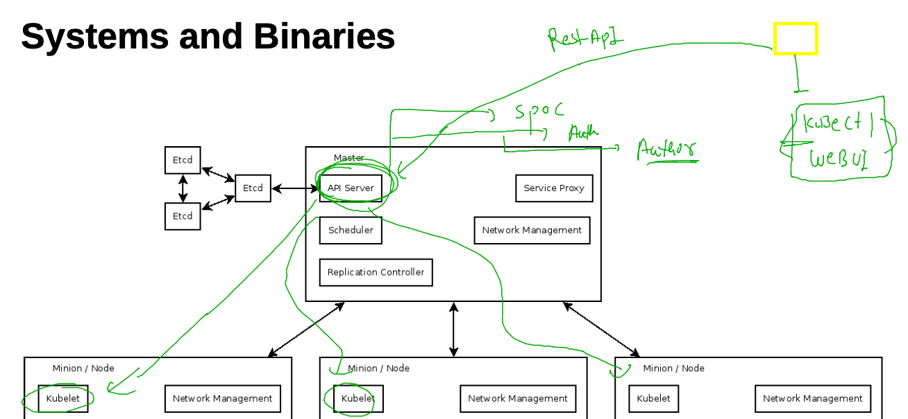
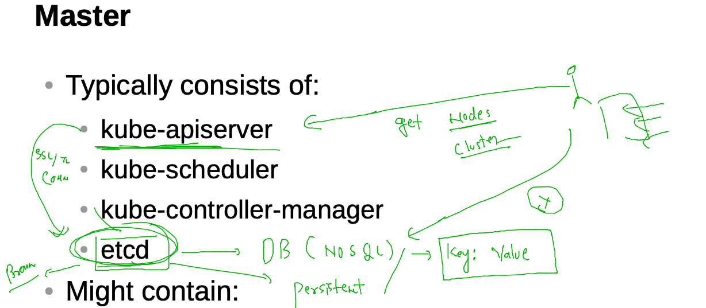
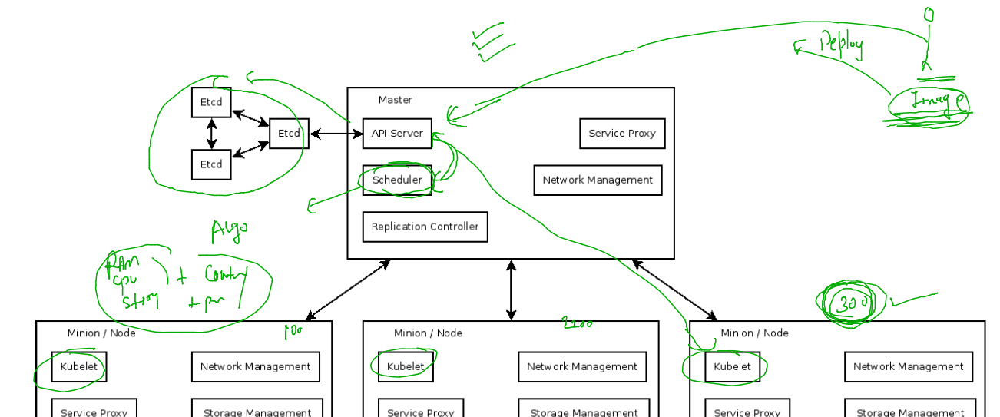
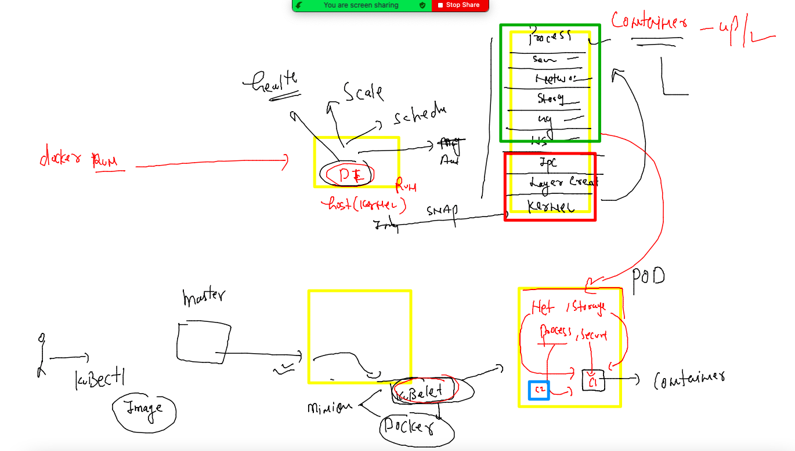

# Plan 



## day1 revision 



### Docker host data migration 



### new docker host with external storage 

```
17  mkfs.xfs  /dev/nvme1n1 
   18  mkdir  /mnt/docker-data
   19  mount /dev/nvme1n1  /mnt/docker-data/
   20  vim /etc/fstab 
   21  docker  info 
   22  systemctl status  docker  
   23  vim  /usr/lib/systemd/system/docker.service
   24  systemctl daemon-reload 
   25  systemctl restart docker
   26  docker  info 

```

### Now from Source docker host --

```
 
[root@docker-host ~]# rsync -avr  /var/lib/docker/  root@18.214.154.73:/mnt/docker-data/  
root@18.214.154.73's password: 
sending incremental file list
```
### on the new docker host 

```
systemctl daemon-reload 
[root@ip-172-31-80-255 docker-data]# systemctl restart docker 
[root@ip-172-31-80-255 docker-data]# docker  images
REPOSITORY                           TAG       IMAGE ID       CREATED         SIZE

```

## COntainer orchestration engines 



## k8s architecture Understanding 

### Level 1 arch of k8s 



### LEvel 2 -- Minion side components 



### LEvel 3  master node component -- kube-apiServer. --



### client to cluster / master node connection --

```
kubectl  version 
Client Version: version.Info{Major:"1", Minor:"23", GitVersion:"v1.23.5", GitCommit:"c285e781331a3785a7f436042c65c5641ce8a9e9", GitTreeState:"clean", BuildDate:"2022-03-16T15:58:47Z", GoVersion:"go1.17.8", Compiler:"gc", Platform:"darwin/amd64"}
The connection to the server localhost:8080 was refused - did you specify the right host or port?
fire@ashutoshhs-MacBook-Air ~ % 
fire@ashutoshhs-MacBook-Air ~ % 
fire@ashutoshhs-MacBook-Air ~ % kubectl  cluster-info 

To further debug and diagnose cluster problems, use 'kubectl cluster-info dump'.
The connection to the server localhost:8080 was refused - did you specify the right host or port?
fire@ashutoshhs-MacBook-Air ~ % 

```
### location of auth file in master node / cluster side 

```
[root@control-plane ~]# cd  /etc/kubernetes/
[root@control-plane kubernetes]# ls
admin.conf
```

### from Client / admin /dev 

```
kubectl  version   --kubeconfig  admin.conf.txt 
Client Version: version.Info{Major:"1", Minor:"23", GitVersion:"v1.23.5", GitCommit:"c285e781331a3785a7f436042c65c5641ce8a9e9", GitTreeState:"clean", BuildDate:"2022-03-16T15:58:47Z", GoVersion:"go1.17.8", Compiler:"gc", Platform:"darwin/amd64"}
Server Version: version.Info{Major:"1", Minor:"23", GitVersion:"v1.23.5", GitCommit:"c285e781331a3785a7f436042c65c5641ce8a9e9", GitTreeState:"clean", BuildDate:"2022-03-16T15:52:18Z", GoVersion:"go1.17.8", Compiler:"gc", Platform:"linux/amd64"}
fire@ashutoshhs-MacBook-Air Desktop % 
fire@ashutoshhs-MacBook-Air Desktop % 
fire@ashutoshhs-MacBook-Air Desktop % 
fire@ashutoshhs-MacBook-Air Desktop % kubectl  cluster-info   --kubeconfig  admin.conf.txt 
Kubernetes control plane is running at https://3.225.69.61:6443
CoreDNS is running at https://3.225.69.61:6443/api/v1/namespaces/kube-system/services/kube-dns:dns/proxy

To further debug and diagnose cluster problems, use 'kubectl cluster-info dump'.

```

### more request 

```
kubectl  get  nodes   --kubeconfig  admin.conf.txt 
NAME            STATUS   ROLES                  AGE    VERSION
control-plane   Ready    control-plane,master   4h5m   v1.23.5
minion1         Ready    <none>                 4h2m   v1.23.5
minion2         Ready    <none>                 4h2m   v1.23.5
```

### copy auth file in default location 

```
% cp  admin.conf.txt  ~/.kube/config 
fire@ashutoshhs-MacBook-Air Desktop % 
fire@ashutoshhs-MacBook-Air Desktop % 
fire@ashutoshhs-MacBook-Air Desktop % 
fire@ashutoshhs-MacBook-Air Desktop % kubectl  get nodes
NAME            STATUS   ROLES                  AGE    VERSION
control-plane   Ready    control-plane,master   4h7m   v1.23.5
minion1         Ready    <none>                 4h4m   v1.23.5
minion2         Ready    <none>                 4h4m   v1.23.5
fire@ashutoshhs-MacBook-Air Desktop % 
fire@ashutoshhs-MacBook-Air Desktop % kubectl  cluster-info                                
Kubernetes control plane is running at https://3.225.69.61:6443
CoreDNS is running at https://3.225.69.61:6443/api/v1/namespaces/kube-system/services/kube-dns:dns/proxy

To further debug and diagnose cluster problems, use 'kubectl cluster-info dump'.
```


### ETCD -- brain of k8s 



### kube-schedular in master node 



## Deploy apps in k8s 


### Intro to POD 



## kubernetes api resources 


### first poD file 

```
apiVersion: v1 # requesting to apiversion v1 
kind: Pod # type of resource under above define apiVersion 
metadata: # info about resouces like name
  name: ashupod-007  # name of my POd 
spec: # info about your container app 
  containers:
  - name: ashuc1 # name of container inside pod 
    image: nginx # name of image from Docker hub 
    ports:
    - containerPort: 80  # app port that will be used by container 

```

### testing and deploy POd 

```
kubectl create  -f  ashupod1.yaml --dry-run=client 
pod/ashupod-007 created (dry run)
fire@ashutoshhs-MacBook-Air containers_apps % 
fire@ashutoshhs-MacBook-Air containers_apps % kubectl create  -f  ashupod1.yaml                  
pod/ashupod-007 created
fire@ashutoshhs-MacBook-Air containers_apps % kubectl  get  pods
NAME               READY   STATUS    RESTARTS   AGE
ashupod-007        1/1     Running   0          60s
natarajanpod-007   1/1     Running   0          37s
rameshpod-007      1/1     Running   0          41s

```

### pod got scheduled 

```
kubectl  get  nodes
NAME            STATUS   ROLES                  AGE     VERSION
control-plane   Ready    control-plane,master   6h40m   v1.23.5
minion1         Ready    <none>                 6h37m   v1.23.5
minion2         Ready    <none>                 6h37m   v1.23.5
fire@ashutoshhs-MacBook-Air containers_apps % kubectl  get  pods ashupod-007  -o wide
NAME          READY   STATUS    RESTARTS   AGE     IP                NODE      NOMINATED NODE   READINESS GATES
ashupod-007   1/1     Running   0          8m59s   192.168.179.194   minion2   <none>           <none>
fire@ashutoshhs-MacBook-Air containers_apps % 

```

### checking scheduling of all the pods 

```
 kubectl  get  pods   -o wide           
NAME               READY   STATUS    RESTARTS   AGE     IP                NODE      NOMINATED NODE   READINESS GATES
ashupod-007        1/1     Running   0          10m     192.168.179.194   minion2   <none>           <none>
devvpod-100        1/1     Running   0          3m38s   192.168.34.4      minion1   <none>           <none>
natarajanpod-007   1/1     Running   0          10m     192.168.179.195   minion2   <none>           <none>
rameshpod-007      1/1     Running   0          10m     192.168.34.3      minion1   <none>           <none>
ronipod-043        1/1     Running   0          3m8s    192.168.179.196   minion2   <none>           <none>
```

### describe pod info 

```
kubectl  describe   pods ashupod-007 
Name:         ashupod-007
Namespace:    default
Priority:     0
Node:         minion2/172.31.85.213
Start Time:   Tue, 05 Apr 2022 14:34:07 +0530
Labels:       <none>
Annotations:  cni.projectcalico.org/containerID: d32136e963acdabfa36016987c4dea4e4f0bc7aaf3b8ebd2266b58253981489c
              cni.projectcalico.org/podIP: 192.168.179.194/32
              cni.projectcalico.org/podIPs: 192.168.179.194/32
Status:       Running
IP:           192.168.179.194
IPs:
  IP:  192.168.179.194
Containers:
  ashuc1:
    Container ID:   docker://4f0dea3d602de20ee96a24b6e0144c9e2d2203eab6cec3a01f155413a269a1c7
    Image:          nginx

```

### checking logs of container running inside pod 

```
kubectl  logs  ashupod-007 
/docker-entrypoint.sh: /docker-entrypoint.d/ is not empty, will attempt to perform configuration
/docker-entrypoint.sh: Looking for shell scripts in /docker-entrypoint.d/
/docker-entrypoint.sh: Launching /docker-entrypoint.d/10-listen-on-ipv6-by-default.sh
10-listen-on-ipv6-by-default.sh: info: Getting the checksum of /etc/nginx/conf.d/default.conf
10-listen-on-ipv6-by-default.sh: info: Enabled listen on IPv6 in /etc/nginx/conf.d/default.conf
/docker-entrypoint.sh: Launching /docker-entrypoint.d/20-envsubst-on-templates.sh
/docker-entrypoint.sh: Launching /docker-entrypoint.d/30-tune-worker-processes.sh
/docker-entrypoint.sh: Configuration complete; ready for start up
2022/04/05 09:04:12 [notice] 1#1: using the "epoll" event method
2022/04/05 09:04:12 [notice] 1#1: nginx/1.21.6

```

### access container shell inside pod 

```
 kubectl  exec  -it ashupod-007  -- bash 
root@ashupod-007:/# 
root@ashupod-007:/# 
root@ashupod-007:/# 
root@ashupod-007:/# ls
bin   dev                  docker-entrypoint.sh  home  lib64  mnt  proc  run   srv  tmp  var
boot  docker-entrypoint.d  etc                   lib   media  opt  root  sbin  sys  usr
root@ashupod-007:/# cat /etc/os-release 
PRETTY_NAME="Debian GNU/Linux 11 (bullseye)"
NAME="Debian GNU/Linux"
VERSION_ID="11"
VERSION="11 (bullseye)"
VERSION_CODENAME=bullseye
ID=debian
HOME_URL="https://www.debian.org/"
SUPPORT_URL="https://www.debian.org/support"
BUG_REPORT_URL="https://bugs.debian.org/"
root@ashupod-007:/# exit
exit

```

### deleting pod 

```
kubectl delete pod  ashupod-007
pod "ashupod-007" deleted

```

### static scheduling 

```
 kubectl  create -f  ashupod1.yaml 
pod/ashupod-007 created
fire@ashutoshhs-MacBook-Air containers_apps % kubectl  get po -o wide
NAME            READY   STATUS    RESTARTS   AGE   IP             NODE      NOMINATED NODE   READINESS GATES
ashupod-007     1/1     Running   0          5s    192.168.34.5   minion1   <none>           <none>
```
