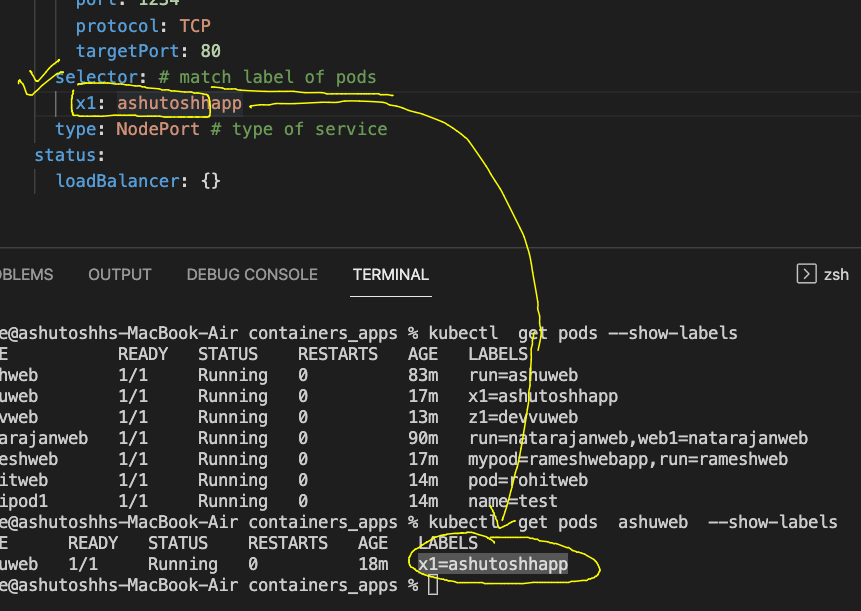

# Plan 


## CNI model of container networking adopted by k8s 


### pods can have ip address from CNI bridge 


### checking pod to pod communication 

```
 kubectl  run  ashupod1  --image=alpine  --command ping 127.0.0.1 
pod/ashupod1 created
fire@ashutoshhs-MacBook-Air ~ % kubectl  get  pods
NAME       READY   STATUS    RESTARTS   AGE
ashupod1   1/1     Running   0          4s
fire@ashutoshhs-MacBook-Air ~ % kubectl  get  pods -o wide
NAME       READY   STATUS    RESTARTS   AGE   IP                NODE      NOMINATED NODE   READINESS GATES
ashupod1   1/1     Running   0          10s   192.168.179.222   minion2   <none>           <none>
fire@ashutoshhs-MacBook-Air ~ % 

```

### testing 

```
 % kubectl  get  pods -o wide
NAME         READY   STATUS              RESTARTS   AGE    IP                NODE      NOMINATED NODE   READINESS GATES
ashupod1     1/1     Running             0          109s   192.168.179.222   minion2   <none>           <none>
natrajpod1   0/1     ContainerCreating   0          2s     <none>            minion2   <none>           <none>
rameshpod1   1/1     Running             0          13s    192.168.34.20     minion1   <none>           <none>
rohitpod1    1/1     Running             0          60s    192.168.179.223   minion2   <none>           <none>
ronipod1     1/1     Running             0          56s    192.168.34.19     minion1   <none>           <none>
fire@ashutoshhs-MacBook-Air ~ % 
fire@ashutoshhs-MacBook-Air ~ % kubectl  exec -it  ashupod1  -- sh 
/ # ping  192.168.34.19
PING 192.168.34.19 (192.168.34.19): 56 data bytes
64 bytes from 192.168.34.19: seq=0 ttl=62 time=0.777 ms
64 bytes from 192.168.34.19: seq=1 ttl=62 time=0.417 ms
64 bytes from 192.168.34.19: seq=2 ttl=62 time=0.369 ms
^C

```

### auto generating pod yaml 

```
 kubectl run ashuweb  --image=dockerashu/customerapp:30thmarch2022   --port 80 --dry-run=client -oyaml  >webapp.yaml

```

### creating webapp pod 

```
kubectl create -f webapp.yaml 
pod/ashuweb created
fire@ashutoshhs-MacBook-Air containers_apps % kubectl  get  pods
NAME      READY   STATUS    RESTARTS   AGE
ashuweb   1/1     Running   0          9s
```

### exposing local to k8s client machine 

```
kubectl port-forward   ashuweb  1234:80 
Forwarding from 127.0.0.1:1234 -> 80
Forwarding from [::1]:1234 -> 80
Handling connection for 1234
Handling connection for 1234

```

### Internal LB 


### Internal LB via Service resource type 


### Service Internal LB will be using Label to find related POds 


### checking and changing label of pods


### label changing methods 

```
1019  kubectl apply  -f webapp.yaml
 1020  kubectl  get pods --show-labels
 1021  history
 1022  kubectl label 
 1023  kubectl label pod ashuweb  x2=helloashuapp
 1024  kubectl  get pods --show-labels
fire@ashutoshhs-MacBook-Air containers_apps % kubectl  replace -f webapp.yaml --force
pod "ashuweb" deleted
pod/ashuweb replaced

```

### checking label of pod

```
% kubectl  get pods --show-labels
NAME           READY   STATUS        RESTARTS   AGE     LABELS
akshweb        1/1     Running       0          68m     run=ashuweb
ashuweb        1/1     Running       0          2m44s   x1=ashutoshhapp

```

### type of service 
### Note: every type of service will be creating Internal LB 


## NodePort

```

fire@ashutoshhs-MacBook-Air containers_apps % kubectl create  service 
Create a service using a specified subcommand.

Aliases:
service, svc

Available Commands:
  clusterip    Create a ClusterIP service
  externalname Create an ExternalName service
  loadbalancer Create a LoadBalancer service
  nodeport     Create a NodePort service


```

### Understanding service creating 


### selector to pod label 



### service deploy 

```
 kubectl create  -f  ashulb1.yaml
 fire@ashutoshhs-MacBook-Air containers_apps % kubectl  get svc
NAME           TYPE        CLUSTER-IP      EXTERNAL-IP   PORT(S)          AGE
ashulb1        NodePort    10.99.145.39    <none>        1234:30257/TCP   10m
devlbaas       NodePort    10.97.67.51     <none>        1234:31583/TCP   9m4s
kubernetes     ClusterIP   10.96.0.1       <none>        443/TCP          163m

```

### External LB and DNs 


